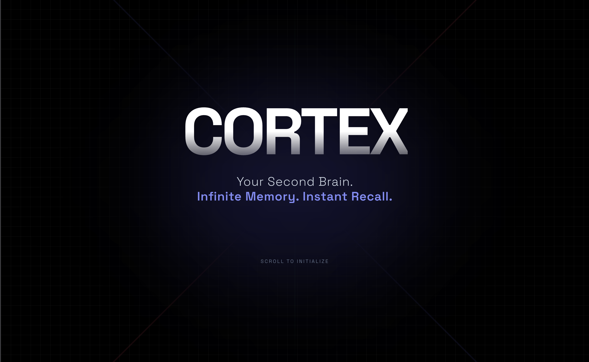
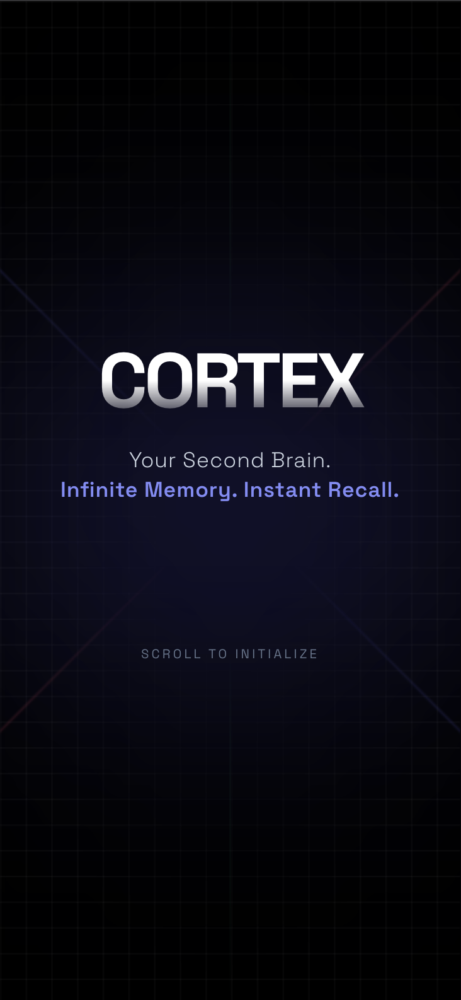
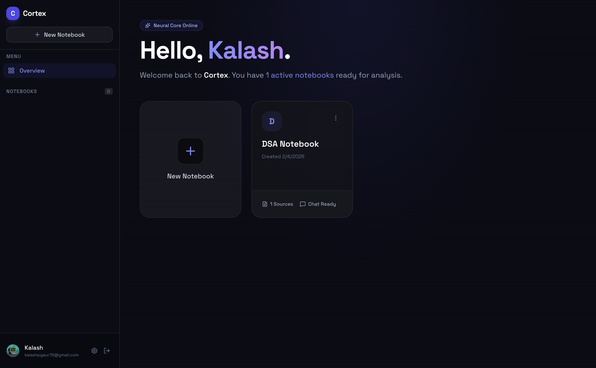
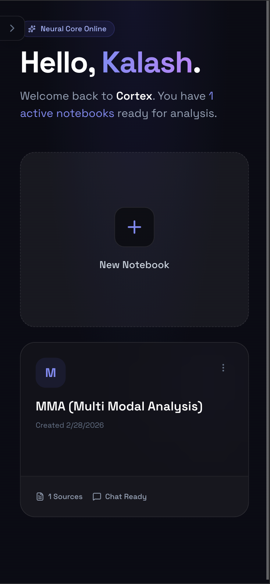
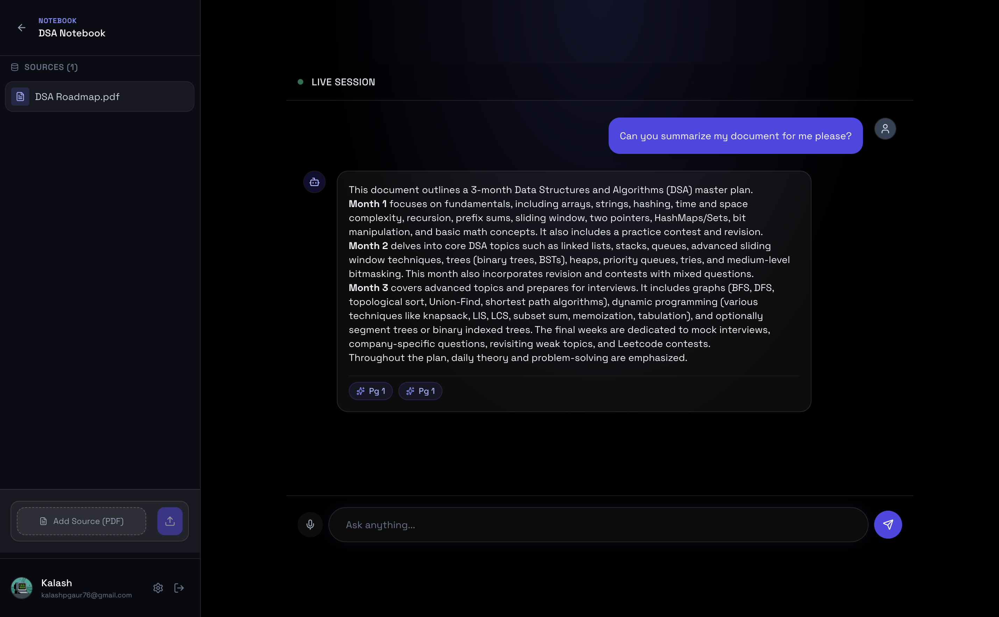
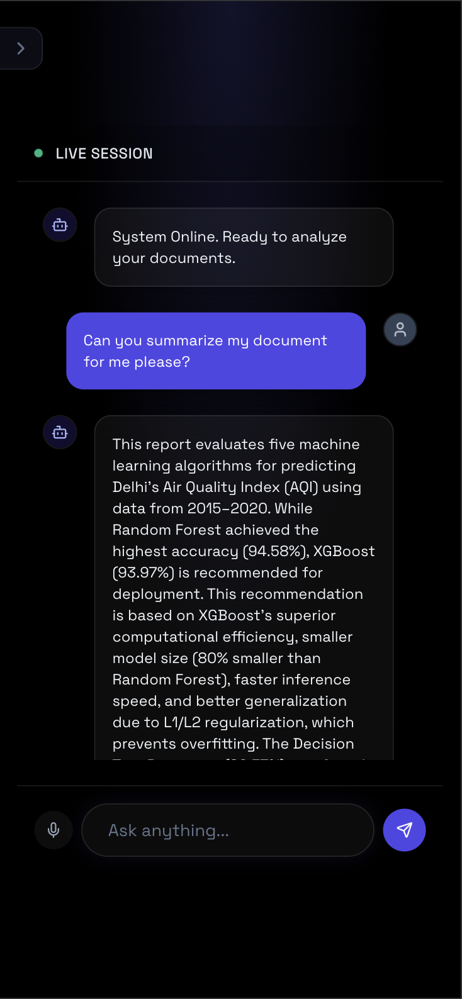
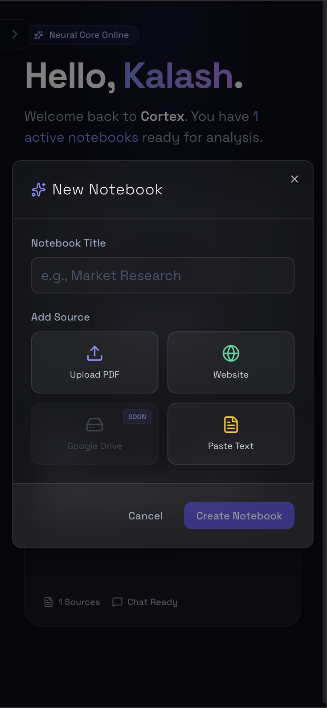
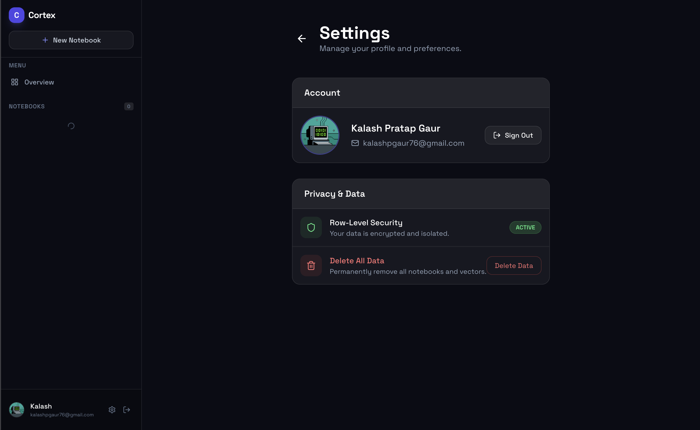
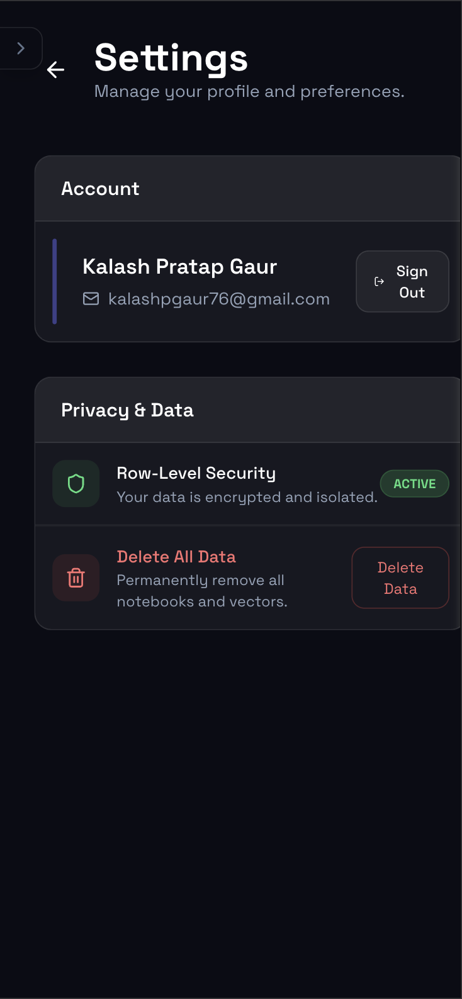

  <h1 style="margin-bottom: 10px;">Cortex: Your AI-Powered Research Assistant</h1>

  

    <strong>Analyze. Synthesize. Strategize.</strong>
  

   

  

    A powerful <strong>RAG (Retrieval-Augmented Generation)</strong> platform 
    fueled by <strong>Gemini 2.5 Flash</strong> and <strong>LangGraph</strong>.
      
    Transforming static documents, PDFs, and web links into interactive, actionable research notebooks.
  

   

  

    
    
  

  

    
    
    
    
  

   

  <table width="100%">
    <tr>
      <td align="center" width="70%">
        
      </td>
      <td align="center" width="30%">
        
      </td>
    </tr>
  </table>

 

<h2>⚡ Key Features</h2>
<ul>
  <li><strong>🤖 Agentic Reasoning Loop:</strong> Powered by <strong>LangGraph</strong>, allowing the AI to "think" through complex queries rather than just retrieving text.</li>
  <li><strong>🧠 Enterprise RAG Pipeline:</strong> Orchestrated by <strong>LangChain</strong> for precise document chunking, citation, and hallucination reduction.</li>
  <li><strong>🔑 Bring Your Own Key (BYOK):</strong> A secure, user-centric architecture that requires users to provide their own Gemini API key (AES-encrypted in the database) to use the app, ensuring zero LLM costs for the host.</li>
  <li><strong>🛡️ Production-Ready Guardrails:</strong> Hardened with <strong>Upstash Redis</strong> rate-limiting (req/min & req/day) and Supabase row-level security quotas (max notebooks/files) to protect the backend from abuse.</li>
  <li><strong>🔍 Deep Semantic Search:</strong> Utilizes <strong>Supabase pgvector</strong> to find hidden connections across massive PDF uploads and web pages.</li>
  <li><strong>📊 Live Analytics Dashboard:</strong> A highly responsive, <strong>collapsible React interface</strong> featuring real-time state synchronization via custom dispatch events. Fully optimized for both Desktop and Mobile.</li>
</ul>

 

<h2>📸 Interface Preview</h2>

<h3>Intelligent Analytics Dashboard (Responsive)</h3>

  <table width="100%">
    <tr>
      <td align="center" width="70%">
        
          <strong>Desktop View (Collapsible Sidebar)</strong>
      </td>
      <td align="center" width="30%">
        
          <strong>Mobile View</strong>
      </td>
    </tr>
  </table>

 

<h3>Context-Aware AI Chat</h3>

  <table width="100%">
    <tr>
      <td align="center" width="70%">
        
          <strong>Immersive Reading Mode</strong>
      </td>
      <td align="center" width="30%">
        
          <strong>Mobile Chat Interface</strong>
      </td>
    </tr>
  </table>

 

<h3>Data Ingestion & Controls</h3>

  <table width="100%">
    <tr>
      <td align="center" width="70%">
        
          <strong>Context Upload</strong>
      </td>
      <td align="center" width="30%">
        
          <strong>Mobile View</strong>
      </td>
    </tr>
    <tr>
      <td align="center" width="70%">
        
          <strong>User Preferences</strong>
      </td>
      <td align="center" width="30%">
        
          <strong>Mobile Config</strong>
      </td>
    </tr>
  </table>

 

<h2>🚀 Getting Started</h2>

<h3>1. Backend Setup</h3>
<pre><code>cd backend
python -m venv .venv
source .venv/bin/activate  # Windows: .venv\Scripts\activate
pip install -r requirements.txt
</code></pre>

<h3>2. Frontend Setup</h3>
<pre><code>cd ../frontend
npm install
</code></pre>

<h3>3. Environment Variables</h3>

Create <code>.env</code> files in both <code>backend</code> and <code>frontend</code> directories following the <code>.env.example</code> templates.

<h3>4. Run the Application</h3>

  
<strong>Terminal 1 — Backend</strong>

  <pre style="margin:0 0 20px 0;"><code>cd backend
python -m uvicorn main:app --reload</code></pre>

  

  
<strong>Terminal 2 — Frontend</strong>

  <pre style="margin:0;"><code>cd frontend
npm run dev</code></pre>

 

  

  

    Built with ❤️ by <a href="https://github.com/CaSh007s"><strong>Kalash Pratap Gaur</strong></a>
  

  

    <a href="https://github.com/CaSh007s">GitHub</a> •
    <a href="https://github.com/CaSh007s/cortex">Repository</a>
  

